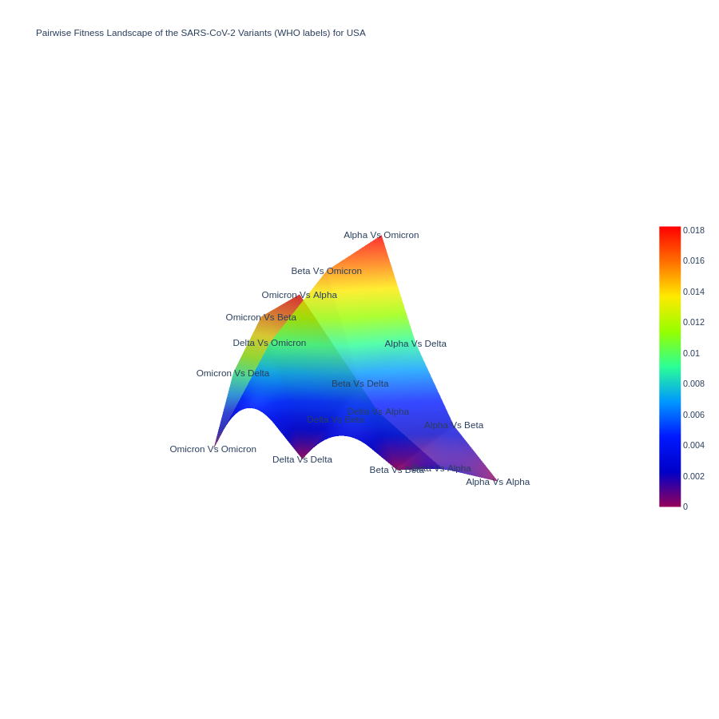
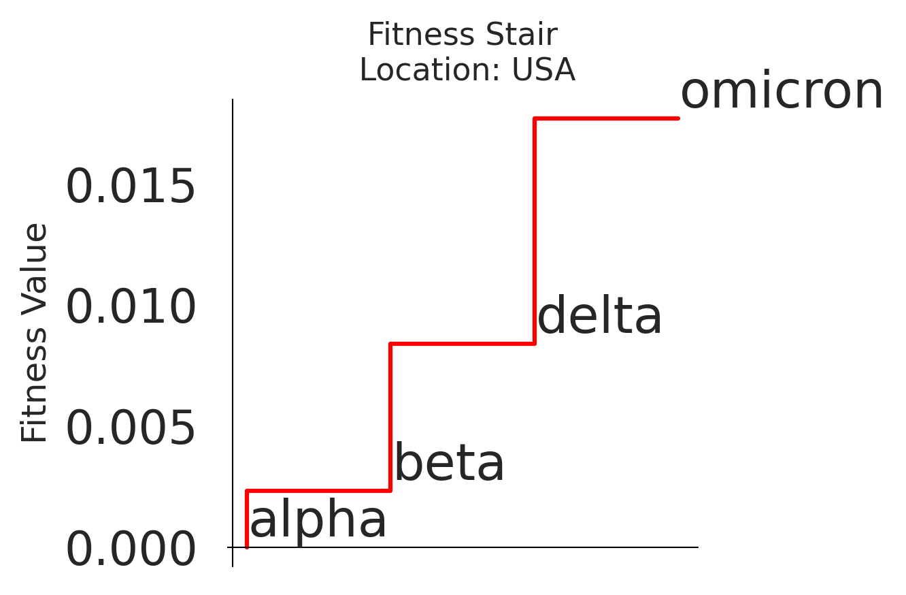

# A Data-Driven Sliding-window Pairwise Comparative Approach for the Estimation of Transmission Fitness of SARS-CoV-2 Variants and Construction of the Evolution Fitness Landscape
[Preprint Link to the Manuscript](https://www.medrxiv.org/content/10.1101/2024.07.23.24310886v1)
[Data Source](https://gisaid.org/)
## Table of Contents
- [Overview](#Overview)
- [Installation](#installation)
- [Key Insights](#key-insights)
- [Project Structure](#project-structure)
<!-- - [License](#license) -->
<!-- - [Usage](#usage) -->

## Overview
This repository contains the Differential Population Growth Rate (DPGR) model, a novel sliding-window, data-driven approach to estimate and compare the transmission fitness of SARS-CoV-2 variants. DPGR utilizes pairwise comparisons across specific time windows to quantify relative fitness advantages between viral strains, creating a dynamic fitness landscape that reflects the evolutionary trends of Variants of Concern (VOCs) such as Omicron and Delta. This generalized approach is appilcable to any viral surveillance dataset of exponentially growing viral populations.

By addressing key issues with sampling biases and allowing for real-time epidemiological insights, DPGR provides a robust framework that complements transmission fitness estimation.


## Installation
To set up and run the project locally, clone this repository and install the necessary dependencies:

```bash
git clone https://github.com/QinLab/DPGR.git
cd DPGR
pip install -r requirements.txt
```

## Key Insights

Here, we highlight some key insights from applying the DPGR model:

### Transmission Fitness Variability by Region
Omicron consistently exhibited higher transmission fitness over Delta across various geographic levels (countries and continents).

#### Transmission Fitness Estimation in the Country Level


#### Transmission Fitness Estimation in the Continent Level


#### Transmission Fitness Estimation for Omicron Sublineages in the Continents


#### Pairwise Distance Matrix
As the method is pairwise, we can directly estimate the transmission fitness of the adjacent variants like DPGRAlpha,Beta, DPGRBeta, Delta and DPGRDelta.Omicron. To infer the transmission fitness of the non-adjacent variants, DPGRAlpha,Delta, DPGRAlpha, Omicron, the property of logarithms (log(a/b) = log(a/c) + log(c/b) is used. Thus, we can infer the growth advantages of non-adjacent variants. The initial variant Alpha is considered as the root variant.
Here, is the Pairwise Distance matrix of SARS-CoV-2 Variants of Concern for the WHO labels:


### Tranmission Fitness Evolution Landscape
The fitness landscape generated through pairwise DPGR analyses shows how each successive variant of concerns of SARS-CoV-2 dominates over the other. This model provides a clear visualization of the evolutionary trajectory in fitness between major VOCs.


### Tranmission Fitness Stair of the Co-Circulating Variants



<!-- 

### Noise and Sampling Bias Robustness
DPGR remains resilient to sampling biases. When Gaussian noise or synthetic sampling bias was introduced, the model continued to yield reliable estimates with a consistent linear trend, indicating its utility in real-world genomic surveillance settings with incomplete data.

 -->

## Project Structure
```
├── Code             # Jupyter notebooks for analysis and visualization
├── Figures          # Visualizations
├── Files            # Estimated Fitness values
├── requirements.txt # Dependency list
└── README.md         # Project documentation
```
