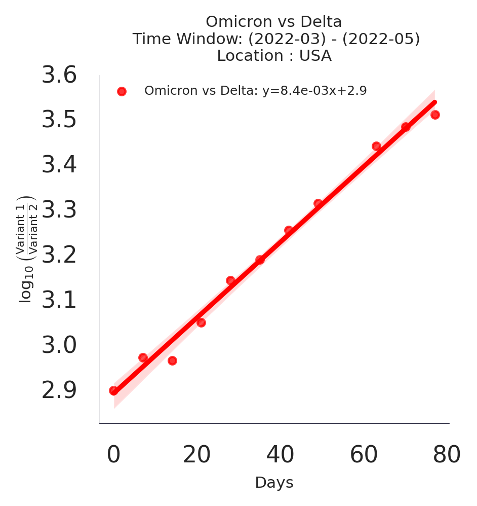
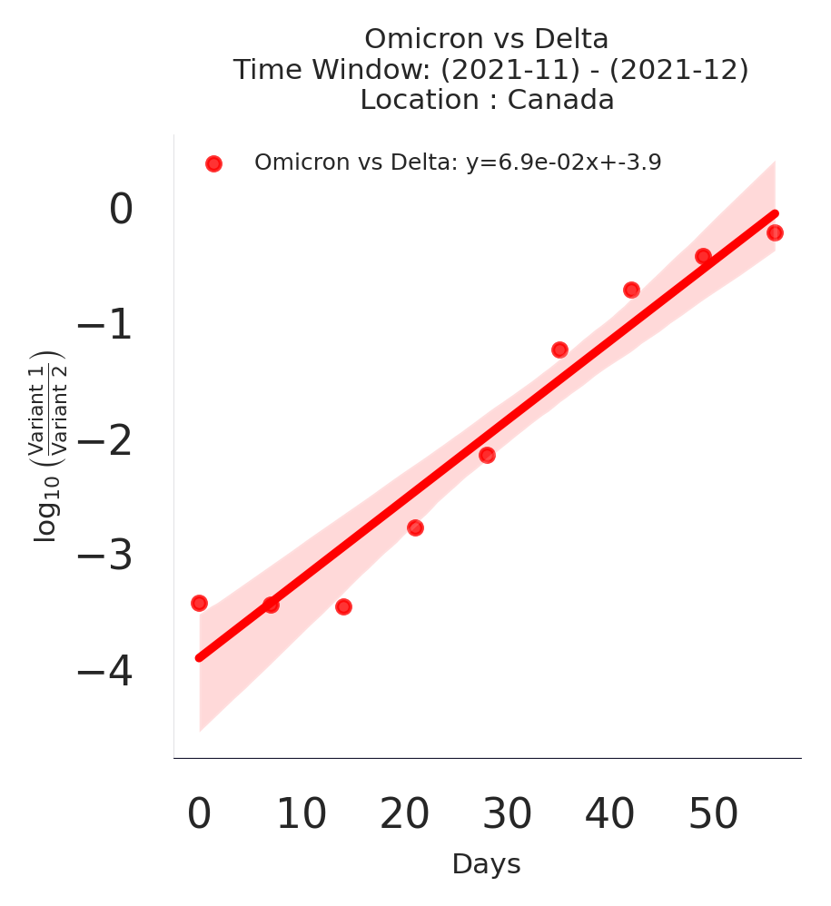
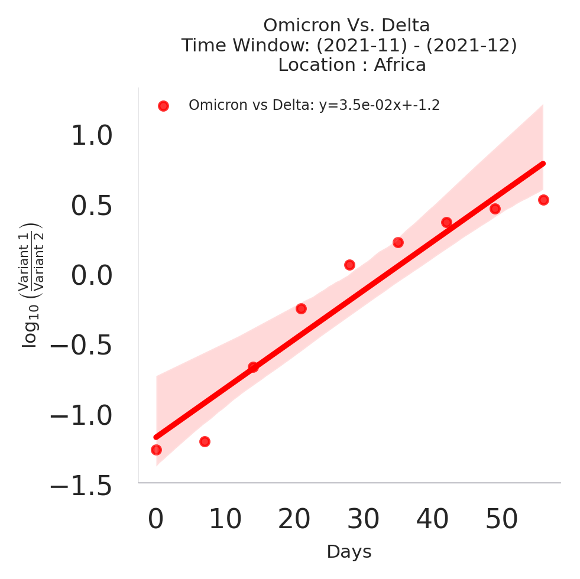
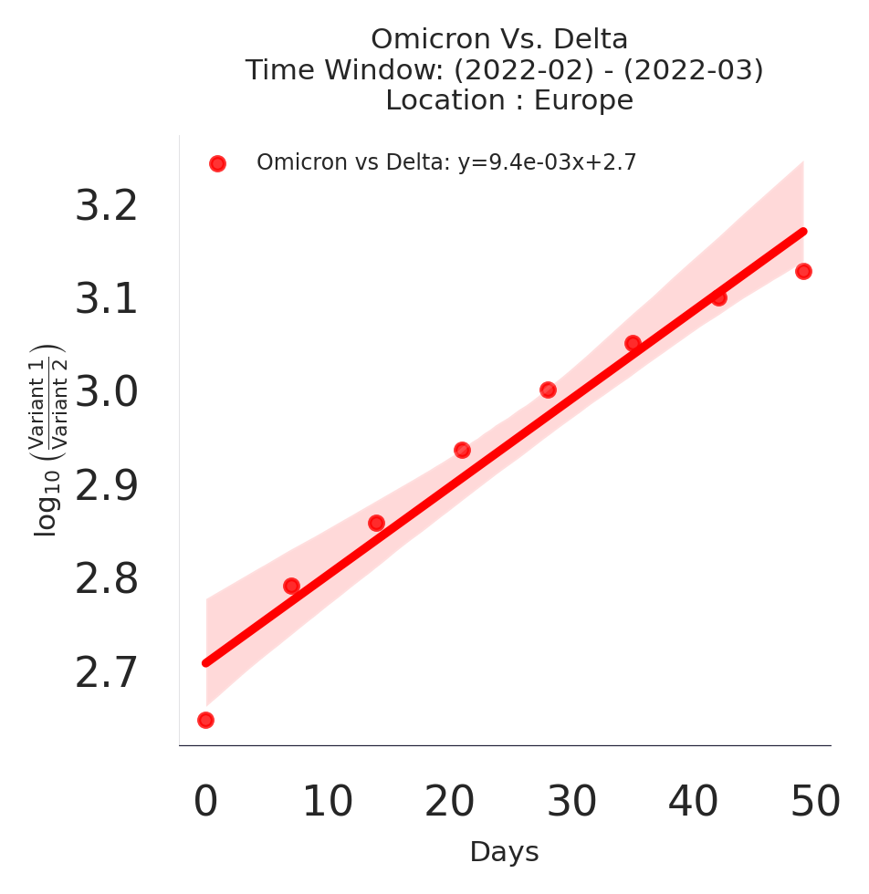

# A Data-Driven Sliding-window Pairwise Comparative Approach for the Estimation of Transmission Fitness of SARS-CoV-2 Variants and Construction of the Evolution Fitness Landscape

## Description
This repository contains the Differential Population Growth Rate (DPGR) model, a novel sliding-window, data-driven approach to estimate and compare the transmission fitness of SARS-CoV-2 variants. DPGR utilizes pairwise comparisons across specific time windows to quantify relative fitness advantages between viral strains, creating a dynamic fitness landscape that reflects the evolutionary trends of Variants of Concern (VOCs) such as Omicron and Delta. This generalized approach is appilcable to any viral surveillance dataset of exponentially growing viral populations.

By addressing key issues with sampling biases and allowing for real-time epidemiological insights, DPGR provides a robust framework that complements transmission fitness estimation.

## Table of Contents
- [Description](#description)
- [Installation](#installation)
- [Key Insights](#key-insights)
- [Data Preprocessing and Sliding Window Approach](#data-preprocessing-and-sliding-window-approach)
- [Project Structure](#project-structure)
- [Results and Insights](#results-and-insights)
<!-- - [License](#license) -->
<!-- - [Usage](#usage) -->

## Installation
To set up and run the project locally, clone this repository and install the necessary dependencies:

```bash
git clone https://github.com/QinLab/DPGR.git
cd DPGR
pip install -r requirements.txt
```

## Key Insights

Here, we highlight some key insights from applying the DPGR model:

### Transmission Fitness Variability by Region
Omicron consistently exhibited higher transmission fitness over Delta across various geographic levels (countries and continents).

#### Fitness Estimation in the Country Level





#### Fitness Estimation in the Continent Level





<!--### Fitness Landscape Evolution
The fitness landscape generated through pairwise DPGR analyses shows how each successive variant, from Alpha to Omicron, demonstrates a stepwise increase in transmission fitness. This model provides a clear visualization of the evolutionary trajectory in fitness between major VOCs.


### Noise and Sampling Bias Robustness
DPGR remains resilient to sampling biases. When Gaussian noise or synthetic sampling bias was introduced, the model continued to yield reliable estimates with a consistent linear trend, indicating its utility in real-world genomic surveillance settings with incomplete data.


